# **Manual** #
### **Author - Team 61** #
# GroceryListManager - Management System for Grocery Lists #

## 1.0 History of the application #

Brad and Janet have requested a new grocery list application. They have been unhappy with existing grocery list applications.  

After the review of our team's submission of our design based on the requirements provided by Brad and Janet.  They both are convinced to commission team 61 to produce the GroceryListManager.

## 2.0 What does the GroceryListManager application do #

The GroceryListManager application will handle the following:

 - **Create, Name, Delete and maintain multiple Grocery Lists**
 - **Allows a Grocery List to be "Selected"** 
 - **All the Data for the GroceryListManager will be maintained an a Database for the user**
 - **GroceryListManager will ensure that the Grocery List is save automatically after each change** 
 - **Users will be able to search  for an Items by name**
 - **Users will be able to add an Item which does not exist in GroceryListManager by selecting the Item type  and inserting**
 - **Users will have the ability to check items within a grocery list**
 - **Users will also be able to remove all check-off at once from Grocery list**  
 - **Users will be able to select Items categorized by Item Type from hierarchical list to:**
	- **Add Item to the selected Grocery List**
	- **Delete Item from the selected Grocery List**
	- **Change the quantity of the Item within the selected Grocery List**

## 3.0 Android's environment #

The GroceryListManager would work only on Android platform

The GroceryListManager is designed for only mobile screens and may not be optimally viewed in tablets.

The GroceryListManager does not support rotation/landscape view.

The mobile should run one of the following supported Andriod OS versions

 - Android Kitkat ( 4.4 - 4.4.4)
 - Android Lollipop ( 5.0 - 5.1.1)
 - Android Marshmallow ( 6.0 - 6.0.1)

### 3.1 System environment:Hardware ###

Any mobile with minimum of 1 GB of RAM
Software

Since the application is based out of Mobile platform, 
the memory consumption of the app cannot be greater than 512 MB

## 4.0 GroceryListManager application ##

The Grocery List Manager starts with a prompt to create or select a Grocery List.

### 4.1 Grocery List Menu ###
   The Grocery List Manager supports multiple lists. When the application is started for the first time, you'll need to create a new Grocery List.

#### 4.1.1 Create a new list  

Create a list by typing a list name into the box and selecting the Add button.

In the photos below we create a new list named "My List":

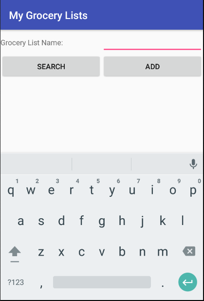

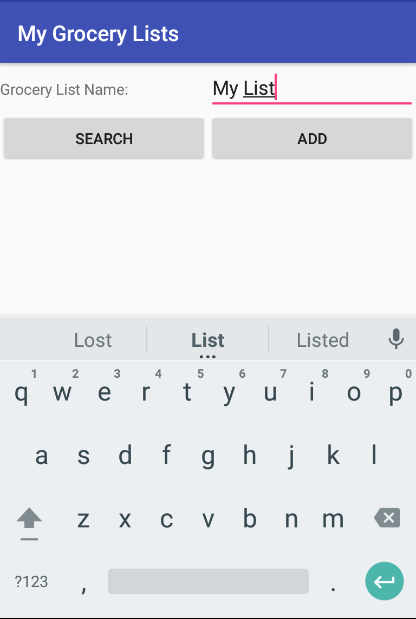

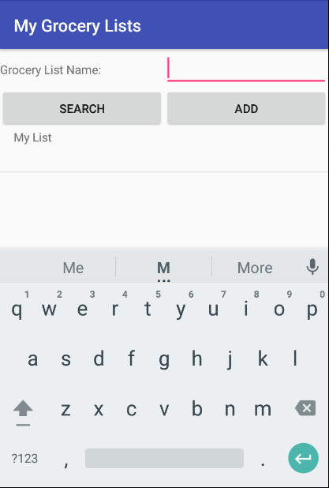

#### 4.1.2 Select a list  

Once you've created a list, you can select it. Click on the list to select it.

### 4.2 Grocery List ###

Your grocery list will serve as your home base. Add items to your shopping list, change their quantity, or delete them before you go shopping to make sure you know exactly what to buy.
When you're at the store, conveniently check items off the list with the push of a button. 
Once you're home, you can reset the list by removing all check marks.  

#### 4.2.1 Rename the list
If you're ready to change the name of the list, use the Rename button, at the top of the screen.

In the photos below we change the name of "My List" to "The List":

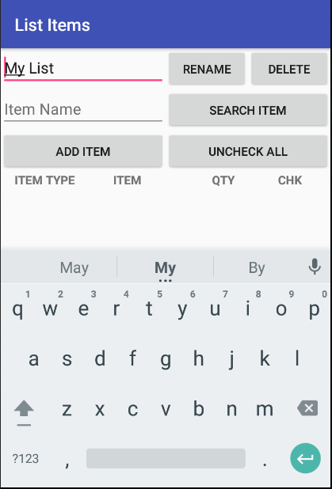

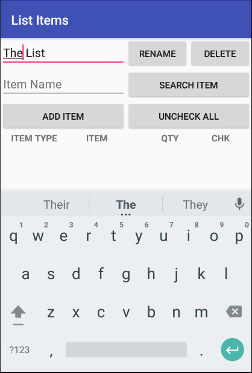

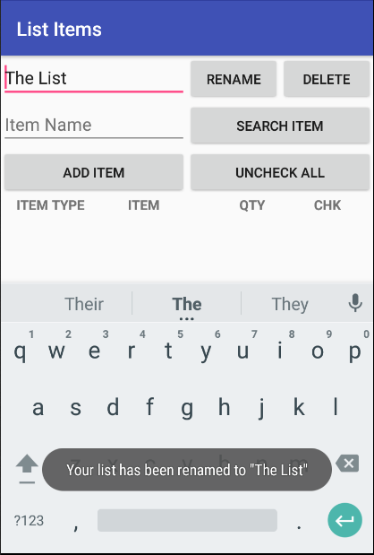

#### 4.2.1 Delete the list

If this list is no longer useful, click the Delete button to delete the list.

#### 4.2.2 Add an item to the list

When you create a new list it will be empty. Use the Add button to add a new item to the list.

When you click Add you'll be asked to select from a given list of items.

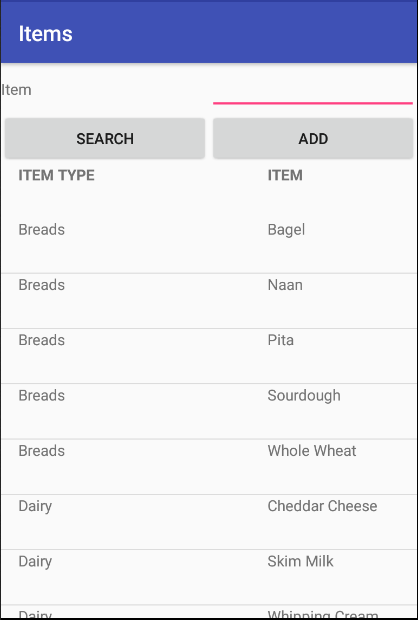

When you're ready to add an item, click on it and you'll be brought back to your list to select the quantity.

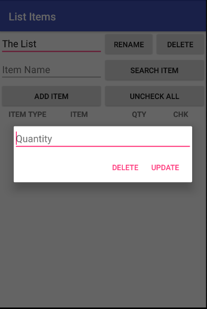

#### 4.2.2.1 Search for an item by name

You can use the search box to narrow down the list of items presented. Enter the name of the item you're looking for and hit search.  

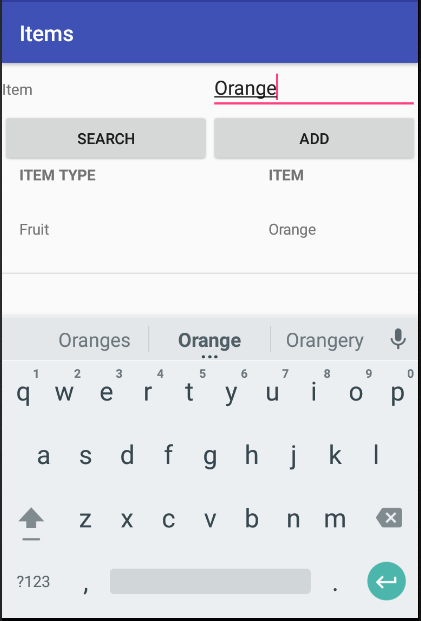

#### 4.2.2.2 Add a new item to the list of items

If you can't find the item you're looking for, you can add it using the Add button.

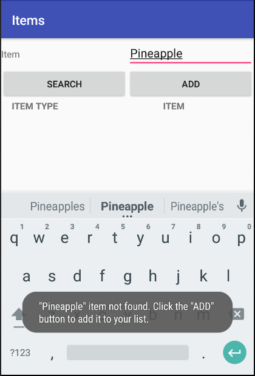

You'll be asked to select an item type. Once selected, the item will be added your grocery list and you'll be brought back to your list to select the quantity.

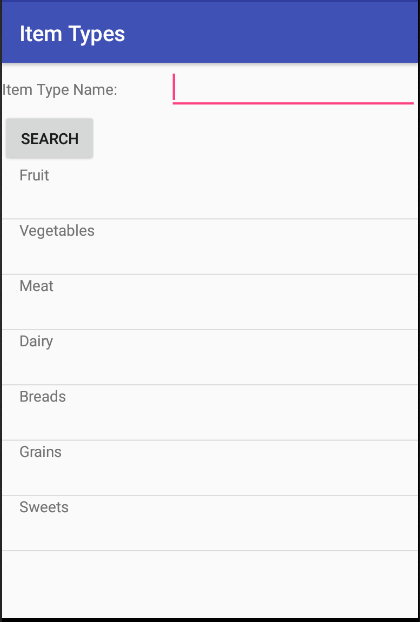

Items added this way will be available to all grocery lists. 

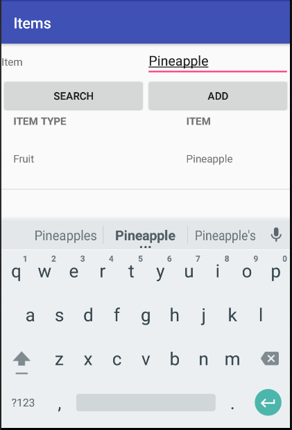

#### 4.2.3 Change an Item's Quantity

Click on an item to change its quantity.

#### 4.2.4 Delete an Item

Click on an item to launch the prompt to delete the item.

#### 4.2.5  Check an Item

Click on an item's checkbox to check the item.

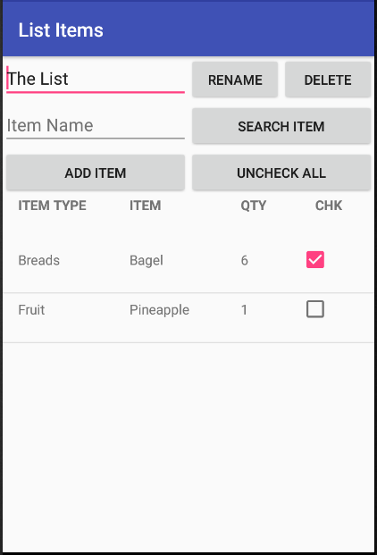

#### 4.2.6 Clear All Check Boxes

Use the Uncheck button to clear the check boxes for each item on your list. You can use this to reset your grocery list for next time.

                                                                                                                                      
